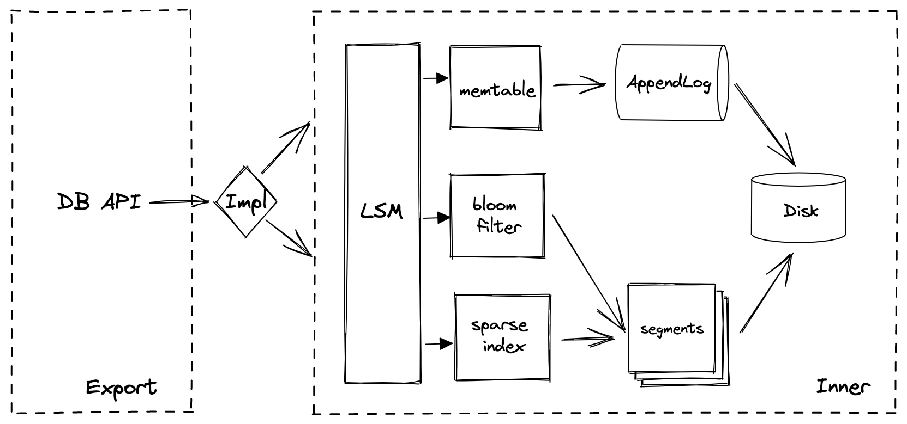

# simplekv

> A simple KV database implementation

## TODO

- [ ] asm murmur3 perf
- [ ] clean code
- [ ] unit, benchmark test

## structure

## key features

1. LSM 日志结构存储引擎，核心点在于顺序写日志，这样就能保证超快的写速度；
2. 内存索引，KV红黑树实现，内存索引有大小限制；
3. 超过内存限制(threshold)后，会将内存数据刷新到磁盘段文件中（segment file）；
4. 在内存中保存了索引、数据方便快速查询，如果仍查不到则去搜索段文件；
5. 如果一个 key 被写了多次，那么就会有很多重复的行，因此需要合并他们(compact)；
6. 当需要刷内存索引至磁盘时，会先将磁盘中的段文件进行合并(compact)；
7. 引入布隆过滤器来加快文件数据查询，不存在的 key 直接返回，避免读文件；
8. sparse index（稀疏索引） 保存了部分 segment-file-offset 信息，方便在文件中搜索；
9. 稀疏索引查询的时候找到比 key 小（对于二叉树的左孩子节点）的文件和索引，然后遍历文件，就能提升效率；
10. WAL 日志用来恢复 memtable；

## references

- [LSM-Tree](https://github.com/chrislessard/LSM-Tree)
- [wal](https://github.com/tidwall/wal)